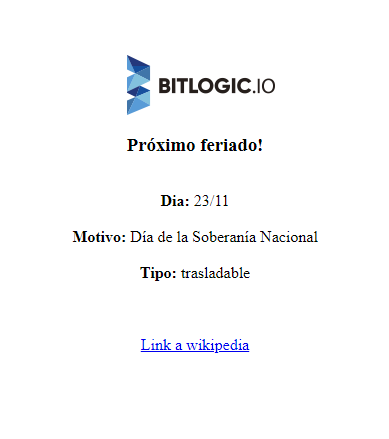

# Proximo Feriado

A simple Dockerfile to get the next holiday on Argentina 


### Pre Requisites

`docker 19.03` or later installed in your machine.

You can check the version with the following command.
``` 
$ docker --version
Docker version 19.03.2, build 6a30dfc
```

### Steps to get the next holiday!
1- Build the image and get the container running on port 9090

``` 
$ docker build -t proximo-feriado .
$ docker run --name feriado -d -p 9090:80 proximo-feriado
```

2- Go to http://localhost:9090/ 

3- You got the next holiday!



## License

<a rel="license" href="http://creativecommons.org/licenses/by-sa/4.0/"></a>

<br />This work is licensed under a <a rel="license" href="http://creativecommons.org/licenses/by-sa/4.0/">Creative Commons Attribution-ShareAlike 4.0 International License</a>.

This license allows you to:

* Share — copy and redistribute the material in any medium or format
* Adapt — remix, transform, and build upon the material

For any purpose, even commercially. The licensor cannot revoke these freedoms as long as you follow the license terms.

